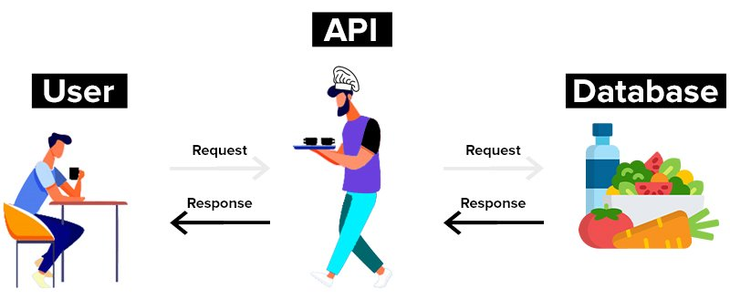
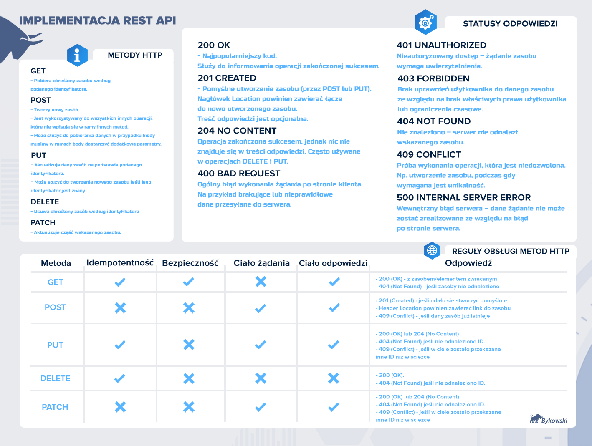
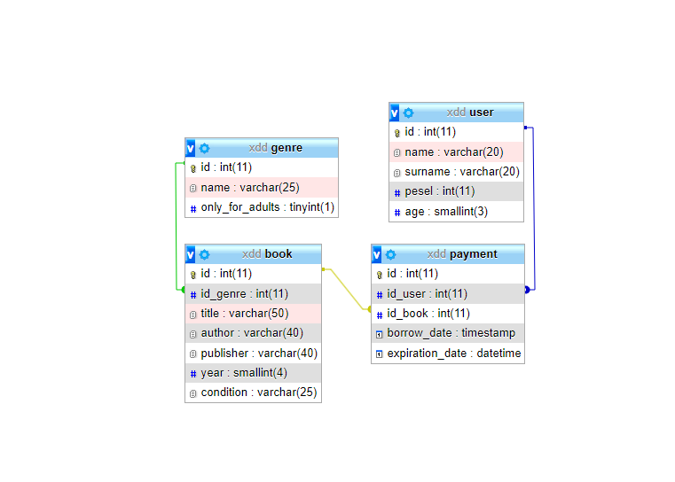

<div align="center">
<h3 align="center">REST API - Studies</h3>
  <p align="center">
    Documentation
</p>
</div>
<br />

## Communication

Communication with the database is based on the requests in the form of appropriate urls:
```http://<server-ip>:<port>/<endpoint>```, for example:
```
http://localhost:8080/users/5
http://localhost:8080/genres/books?page=1&sort=DESC
```



<p align="right">(<a href="#top">back to top</a>)</p>


## Response statuses

The HTTP protocol provides many response statuses that we can provide to the client depending on the progress of their request. There are 5 basic groups:

* 1xx – information
* 2xx – success
* 3xx – redirections
* 4xx – client-side errors
* 5xx – server-side errors

The following is a download that provides information on what code should be returned depending on the action taken



<p align="right">(<a href="#top">back to top</a>)</p>

## Database structure

The used database has the same structure as in the screenshot below:



<p align="right">(<a href="#top">back to top</a>)</p>

## Example requests:

```
GET http://localhost:8080/users/5
GET http://localhost:8080/genres/books?page=1&sort=DESC

POST http://localhost:8080/users" -H "accept: */*" -H "Content-Type: application/json" -d "{ \"name\": \"Testowy\", \"pesel\": 123456789, \"surname\": \"uzytkownik\", \"age\": 21}"
POST "http://localhost:8080/genres/books" -H "accept: */*" -H "Content-Type: application/json" -d "{ \"title\": \"Gra o Tron\", \"idGenre\": 4, \"author\": \"George R. R. Martin\", \"publisher\": \"Wydawnictwo Zysk i S-ka\", \"year\": \"2011\", \"condition\": \"Idealny\"}

PUT http://localhost:8080/users" -H "accept: */*" -H "Content-Type: application/json" -d "{ \"id\": 1, \"name\": \"Andrzej\", \"surname\": \"Gołota\", \"pesel\": 987654321, \"age\", 45"}

DELETE http://localhost:8080/users/payments/2
DELETE "http://localhost:8080/genres/3"
```

<p align="right">(<a href="#top">back to top</a>)</p>